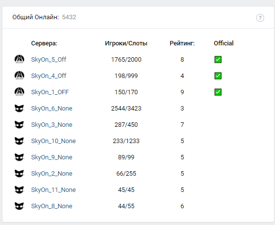

# vk_widget
 Вывод в виджет сообщества информации о активных серверах с автообновлением по таймеру и обновлением данных для входа из porperty файла при команде restart.
 [java 8]
 
Файл GroupLogin.properties можно отредактировать блокнотом. Класть рядом с jar
- GroupId=ID группы
- GroupToken=Токен управления виджетом (Управление - работа с API)
- URL=http:// (Откуда берется json серверов)
- OfficialServerIp=[ip without port]

Запуск jar:
- java -jar /home/user/jar_name.jar - для Linux
- java -jar C:\Users\user\jar_name.jar - для Windows
- nohup java -jar ... & (для работы в фоне)
  
Команды управления:
- help [Выводит текущие команды и желает удачи]
- e [Запуск по дефолту. Обновление раз в 50 секунд]
- q [Завершение работы программы]
- p [Пауза]
- r [рестарт с обновлением данных из property]
- t X [Выставить время обновления и запустить]
- s X - [Где X true or false. Сэйф мод, который не выводит сервера на которых меньше двух человек (помимо официальных)]
- Hs X - [Где X true or false. Сэйф мод. Выводит только офф сервера]

Алгоритм -> Сервера берутся из get запроса с получением json, создаётся список объектов через objectMapper, проводится сортировка по игрокам и статусу сервера, формируется запрос для vk, используя заготовленный шаблон и данные из объектов -> данные отправляются и выводится ответ на консоль. Повторяем через n секунд.

 На данный момент нужно переписать формирование запроса на обновление виджета. Простите за это :'(
 
 Если будете использовать этот код, то укажите samuraryus где-нибудь (:
 
 В версии 3.5 убрал рейтинг
 
 
 
 
Более-менее задокументированная история изменений:
 
Версия 3.5
+++++++++++++++++
- Подлатал код

- HardSafeMode теперь работает (Скрывает все сервера помимо офф)

- Добавил команду help с сюрпризом. Там команды и описание к ним.

- Укоротил все команды до одной буквы

- Теперь при смене ip сервера можно в properties вписать новый ip для того, чтобы показывало галочку в виджете.
 Это можно сделать в процессе выполнения программы, а затем написать в консоль <r> для рестарта.
 Новые данные сразу поступят в обработку

- И еще что-то сделал, но уже забыл. Во всяком всё стало лучше

Версия 3.6
///
Версия 3.7

Добавил черный список. Пока сохраняется локально и при перезапуске стирается.

Версия 3.8
 - Добавил пропинговку по ip у серверов с временем отклика 500 мс. Так не будут выводиться сервера хамачи и тд.
 Доп защита от спамеров рекламой или матом, которых сложно заблокировать из-за легой смены ip.
 - Добавил фильтр по ip `127.x.x.x`. Такие сервера тестовые или опять же спамеры. Их в любом случае не стоит выводить
 - Все что указано выше можно отключить при желании командой local true, тогда все серера будут выводиться.
 - Исправил багу в которой при отрицательном значении игроков общий онлайн уменьшался.
 - Для черного списка починил ввод причины. Теперь там может быть целое предложение, а не одно слово

Версия 3.81
 - Рефач gitignore
 - VkApi 0.5.12 to 1.0.10
