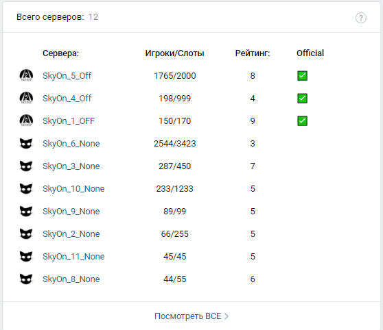

# vk_widget
 Вывод в виджет сообщества информации о активных серверах с автообновлением (50сек). Пока что, сервера берутся из json файла
 В будущем из get запроса.
 Есть консоль.

Алгоритм -> Сервера берутся из JSON файла, создаётся список объектов через objectMapper, проводится сортировка по игрокам и статусу сервера, формируется запрос для vk, используя заготовленный шаблон и данные из объектов -> данные отправляются и выводится ответ на консоль. Повторяем через n секунд.

 На данный момент нужно переписать формирование запроса на обновление виджета

 
